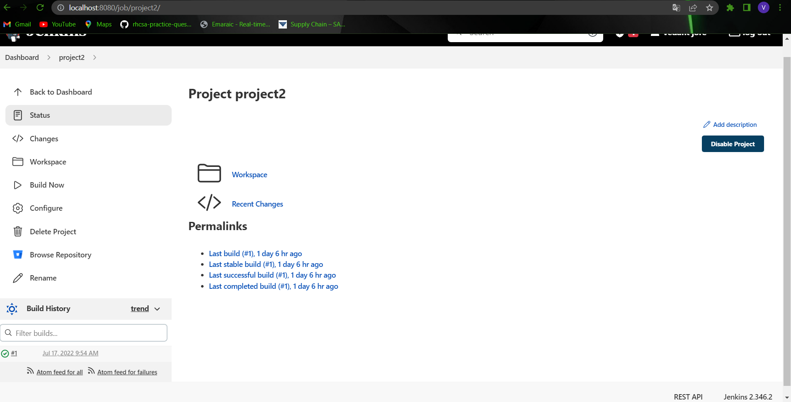

# Jenkins-Bitbucket
## Jenkins bitbucket integration to view build details on build section of bitbucket
### To view information of builds in bitbucket server, We first need to link with our Continous integration (CI) server.
#### 1) Bitbucket server integration on jenkins using Bitbucket server integration plugin : 
#### Steps : 
#### a) Install the plugin: 
##### 1) Go to Jenkins > Manage Jenkins > Manage Plugins.
##### 2) Select the Available tab.
##### 3) Go to Jenkins > Manage Jenkins > Manage Plugins.
##### 4) Tick the checkbox.
##### 5) Select install wothout restart.

#### b) Configure the plugin:
#### Substeps:
##### 1) Add Bitbucket Server instance details : This instance is used to make connection between jenkins with bitbucket.

###### To add a bitbuckeet server instance:
###### 1) go to Jenkins > Manage Jenkins > Configure System.
###### 2) Under Bitbucket server integration, select Add a Bitbucket server instance > Instance details.
###### 3) Enter instance details:
   ###### a) Instance name - Enter any name to identify the instance. ex. instance1
   ###### b) Instance URL - Enter the Bitbucket Server base URL. In my case it's http://localhost:7990/.
   ###### c) Enter a token having a permission of project admin, then enter unique token ID and Description.
   ###### d) click on Add.
###### 4) Click on Test connection to check proper connection.
###### 5) Select Save.

##### 2) Create an Application Link : This will enables additional functionality in Bitbucket server. There are two parts to generate Application link to jenkins.

###### 1) Register Bitbucket Server as a consumer:
    a) Go to Jenkins > Manage Jenkins > Manage Bitbucket Server consumers.
    b) Click on Register new consumer.
    c) Enter details:
       1) Consumer name: Enter any name you want. ex.Bitbucket Sydney
       2) Consumer Key: Enter a unique key that jenkins use to identify bitbucket instance. ex.bitbucket-syd
       3) Shared screte: Enter a password that jenkins can use with key to ideantify bitbucket instance.
       4) Callback URL: Enter your Bitbucket instance's base URL. ex. http://localhost:7990/
    d) Select Save.
    
After you save, you will be redirect to Application link details page which will needed for second part.
else you can also access the same page by going to Jenkins > Manage Jenkins > Manage Bitbucket Server consumers

###### 2) Create an Application Link to Jenkins:for this part we need to do our configuration in bitbucket side.
To create the Application Link:

    a) Go to Administration > Application Links.
    b) Enter the application URL and select Create new link.
    c) Select continue on the warning messagee
    d) fill the form:
      1) Application Name - Enter any name to identify this jenkins instance.
      2) Application Type - Leave as Generic Application.
      3) Service Provider Name - Enter the same name used for Application Name (Step 1)
      4) Consumer Key - See Application link details page.
      5) Shared secret - Enter the secret you created when registering Bitbucket server as a consumer.
      6) Request Token URL - see Application link details page.
      7) Access token URL - see Application link details page.
      8) Authorize URL - see Application link details page.
      9) Create incoming link - leave unchecked.
     e) Select Continue.
     
     
----------------------------------

#### C) Configure the plugin: Create freestyle Job:
##### 1) Go to Jenkins > New item and then select freestyle project.
##### 2) In Source Code Management, select Bitbucket server and enter the details.
##### 3) Under Build Trigger, select Bitbucket webhook trigger, and select push
##### 4) Under Build, add build steps.
##### 5) Select Save.

Step 2:-

step 3:-
 

after build:-

final output:-
 

      
